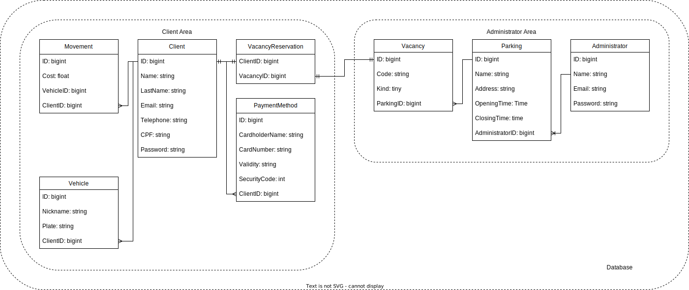

# Client API

Essa API foi desenvolvida para o projeto "Serviço para Estacionamentos Inteligentes" (SEI).

# Estrutura do banco de dados

    

# Tabelas

## Tabela "clients"

Esta tabela representa os clientes da aplicação. Possui os seguintes campos:

- email: campo de texto que armazena o endereço de e-mail do cliente.
- encrypted_password: campo de texto que armazena a senha do cliente criptografada.
- reset_password_token: campo de texto utilizado para armazenar o token de redefinição de senha, caso seja solicitado.
- reset_password_sent_at: campo de data e hora que registra o momento em que o token de redefinição de senha foi enviado.
- remember_created_at: campo de data e hora que registra o momento em que o cliente efetuou o login e selecionou a opção "lembrar de mim".
- created_at: campo de data e hora que registra o momento em que o registro foi criado.
- updated_at: campo de data e hora que registra o momento em que o registro foi atualizado.
- name: campo de texto que armazena o nome do cliente.
- last_name: campo de texto que armazena o sobrenome do cliente.
- telephone: campo de texto que armazena o número de telefone do cliente.
- cpf: campo de texto que armazena o número do CPF do cliente.
- jti: campo de texto utilizado para armazenar o JSON Web Token (JWT) do cliente.

## Tabela "movements"

Esta tabela representa as movimentações de veículos registradas na aplicação. Possui os seguintes campos:

- cost: campo numérico de ponto flutuante que armazena o custo da movimentação do veículo.
- vehicle_id: campo numérico inteiro de identificação do veículo associado à movimentação.
- client_id: campo numérico inteiro de identificação do cliente associado à movimentação.
- created_at: campo de data e hora que registra o momento em que o registro da movimentação foi criado.
- updated_at: campo de data e hora que registra o momento em que o registro da movimentação foi atualizado.

## Tabela "payment_methods"

Esta tabela representa os métodos de pagamento registrados pelos clientes da aplicação. Possui os seguintes campos:

- cardholder_name: campo de texto que armazena o nome do titular do cartão de pagamento.
- card_number: campo de texto que armazena o número do cartão de pagamento.
- validity: campo de texto que armazena a validade do cartão de pagamento.
- security_code: campo numérico inteiro que armazena o código de segurança do cartão de pagamento.
- client_id: campo numérico inteiro de identificação do cliente associado ao método de pagamento.
- created_at: campo de data e hora que registra o momento em que o registro do método de pagamento foi criado.
- updated_at: campo de data e hora que registra o momento em que o registro do método de pagamento foi atualizado.

## Tabela "vacancy_reservations"

Esta tabela representa as reservas de vagas de estacionamento feitas pelos clientes. Possui os seguintes campos:

- client_id: campo numérico inteiro de identificação do cliente que fez a reserva.
- vacancy_id: campo numérico inteiro de identificação da vaga de estacionamento reservada.
- created_at: campo de data e hora que registra o momento em que a reserva foi feita.
- updated_at: campo de data e hora que registra o momento em que a reserva foi atualizada.

## Tabela "vehicles"

Esta tabela representa os veículos registrados pelos clientes da aplicação. Possui os seguintes campos:

- nickname: campo de texto que armazena o apelido ou nome de identificação do veículo.
- plate: campo de texto que armazena a placa do veículo.
- client_id: campo numérico inteiro de identificação do cliente ao qual o veículo pertence.
- created_at: campo de data e hora que registra o momento em que o registro do veículo foi criado.
- updated_at: campo de data e hora que registra o momento em que o registro do veículo foi atualizado.

Além das tabelas acima, o código também contém as chaves estrangeiras (foreign keys) que estabelecem as relações entre as tabelas. Essas chaves estrangeiras garantem a integridade referencial dos dados e permitem a realização de consultas e operações de junção entre as tabelas relacionadas.
